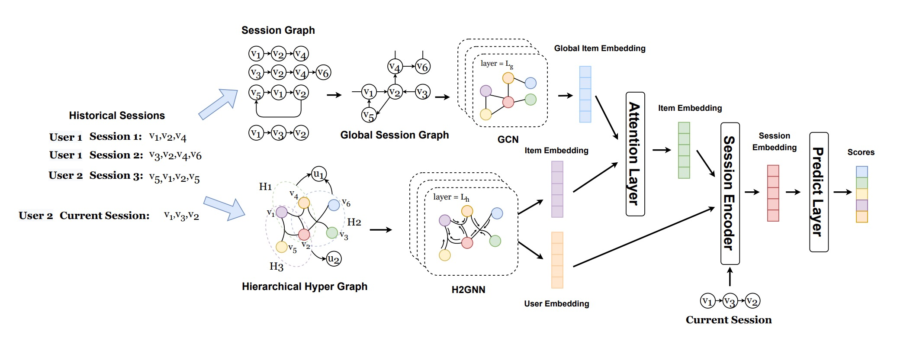

# H3GNN-Hierarchical-HyperGraph-Neural-Network

Personalized Session-based recommendation (PSBR) is a general and challenging task in the real world, which aims at recommending the next item that the user may be interested in based on the user's current interaction session and its historical interaction sessions. In PSBR problem, there exists a natural hierarchical architecture that each session is consists of a series of items and each user is consists of a series of sessions. However, recent methods neglect such informative architecture and merely capture the pairwise relations between items and users by graph neural networks. To effectively exploits such hierarchical architecture, we innovatively propose a hierarchical hypergraph neural network, which treats a session as a set of items and an user as a set of sessions. Moreover, considering that the items in sessions are sequentially ordered, while the relation of items in a hyperedge are set relation, we propose an assistant module to learn the sequential information of items based on a directed global item graph. By attentively combining the embeddings of above two networks, we propose a hybrid framework dubbed H3GNN (Hybrid Hierarchical HyperGraph Neural Network). Extensive experiments on three benchmark datasets demonstrate the superiority of our proposed model over the state-of-the-art methods and ablation experiment results validate the effectiveness of all the components we proposed.

## Model Architecture



## Configuration

Environment
```
Python3, Pytorch 1.6.0, Numpy 1.18.1
```

# Run

run `python main.py`

# FYI

Source code for "H3GNN: Hybrid Hierarchical HyperGraph Neural Network for Personalized Session-based Recommender", ready to submit.
